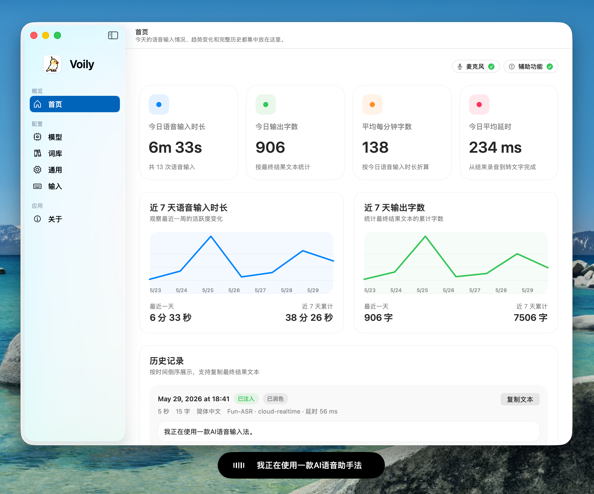
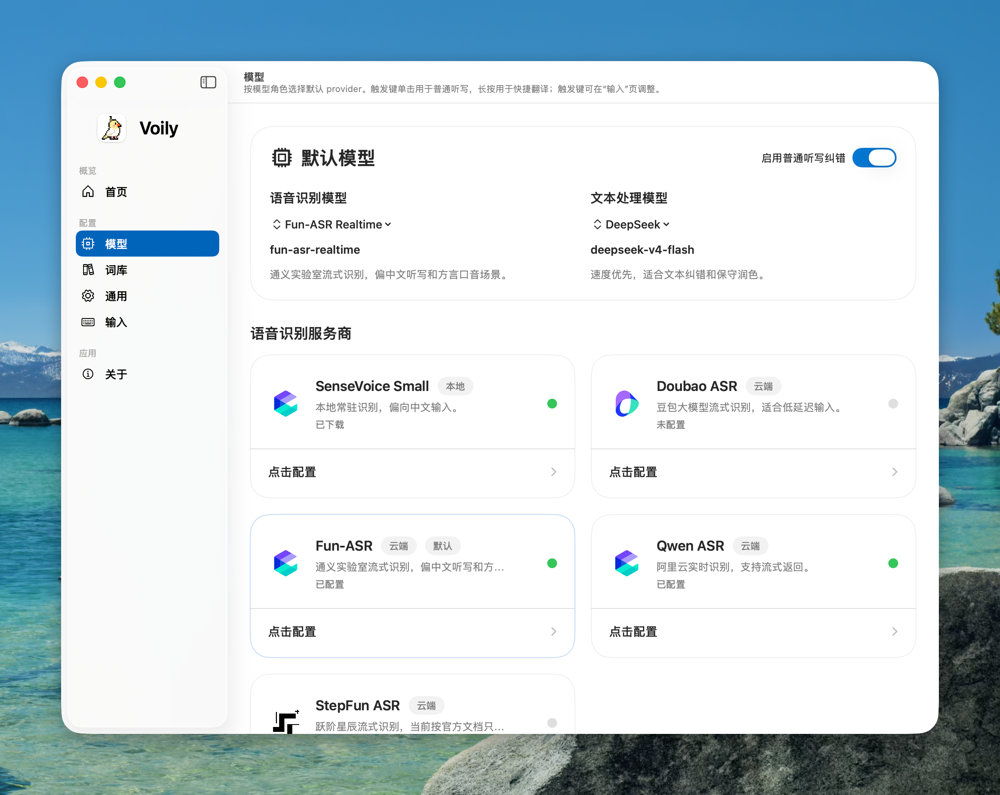
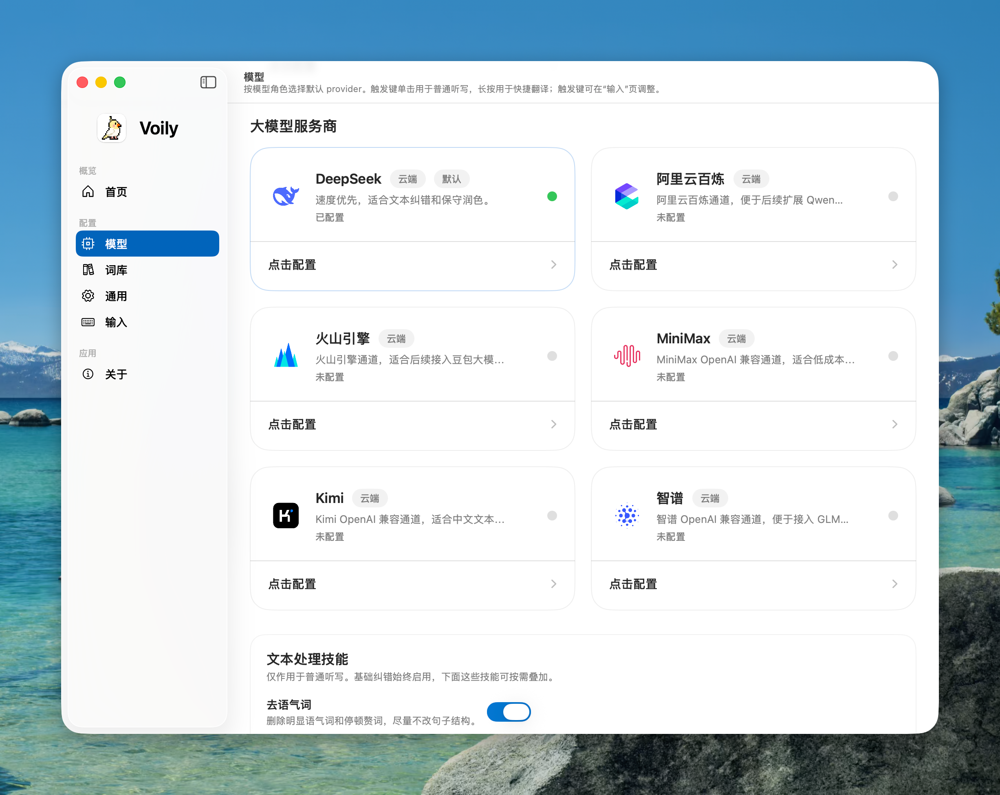
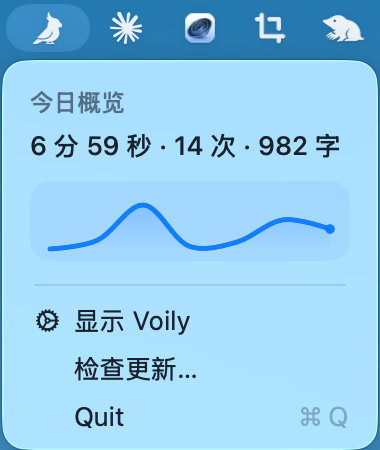

  

<h1 align="center">Voily</h1>

  <b>你只管说，剩下交给我们。</b>

  <a href="./README.md">EN</a>

  
  
  

  

<!-- TODO: swap in a ~5s demo GIF once recorded — trigger key -> speak ->
     overlay transcribes -> text lands at the cursor. Save it as
     assets/screenshots/demo.gif and replace the hero  above. -->

---

Voily 是一款面向 macOS 的开源 AI 语音输入工具。按下触发键，自然说话，文字就出现在光标处——任何应用都行。它不只是转写：可选的 LLM 会顺手清掉语气词、润色措辞，或把中文即时翻译成英文。内置引擎完全在设备端运行，无需 API Key、零成本；想要更高准确率时，云端引擎随时待命。一个键，全部搞定。

## 为什么用 Voily

- **说比打字快** —— 按下触发键、开口说话，文字立即出现在光标处：邮件、编辑器、聊天、终端，任何文本输入框都行。
- **本地优先，隐私无忧** —— 内置 SenseVoice 引擎完全在设备端运行，不联网、无需 API Key、零调用成本。
- **同一个键直接翻译** —— 长按触发键，口述中文，光标处吐出英文。无需切换模式，无需第二个应用。
- **可选 AI 顺稿** —— 交给 LLM 去除语气词、改写成书面正式语体，或把口述的步骤整理成有序列表。
- **轻到没存在感** —— 常驻菜单栏，默认不占 Dock，录音时自动静音系统输出、防止回授。
- **键盘模拟失效的地方也能用** —— 文本通过系统粘贴板注入，因此在沙盒应用、密码框、远程桌面里都能稳定落字。
- **开源、可插拔** —— Apache 2.0，五款 ASR 引擎共用同一套管线。

## 工作原理

按下触发键开始录音。Voily 采集麦克风音频，流式发送给语音识别引擎，可选交给 LLM 润色，最后把结果粘贴到光标处。浮窗实时展示每一步——录音、转写、润色、注入——全程进度看得见。

## 快速开始

### 下载

从 [GitHub Releases](https://github.com/BubblePtr/Voily/releases/latest) 下载最新的 `.dmg`。

### 安装

打开磁盘镜像，将 **Voily.app** 拖入 `应用程序` 文件夹，然后启动。

### 授权

首次启动时，Voily 会请求两项权限：

| 权限 | 用途 |
|---|---|
| 麦克风 | 采集你的语音 |
| 辅助功能 | 将识别文字粘贴到光标位置（不模拟键盘输入） |

权限弹窗会在首次启动时出现。如果关闭了弹窗，可在 **设置 > 输入** 中重新打开。

### 开始听写

1. 在设置中选择触发键（`Fn` 或 `右 Command`）。
2. 选择 ASR 引擎。**SenseVoice Small** 本地运行，开箱即用，无需任何配置。云端引擎（Doubao、Fun-ASR、Qwen、StepFun）需要配置相应的凭证。
3. 按下触发键 -> 说话 -> 再按一次。浮窗会实时显示状态，完成后文字自动出现在光标处。

| 操作 | 手势 |
|---|---|
| 普通听写 | 按触发键 -> 说话 -> 再按一次 |
| 快捷翻译（中 -> 英） | 长按触发键 0.8 秒 -> 说话 -> 确认 |

## 功能特性

### 语音识别引擎

Voily 内置五款 ASR 后端，共用统一的录音转写流程。切换引擎不影响使用体验。

| 引擎 | 运行方式 | 需要 API Key |
|---|---|---|
| **SenseVoice Small** | 本地（MLX） | 不需要 |
| Doubao ASR | 云端（WebSocket） | 需要 |
| Fun-ASR | 云端（WebSocket） | 需要 |
| Qwen ASR | 云端（WebSocket） | 需要 |
| StepFun ASR | 云端（WebSocket） | 需要 |

本地 SenseVoice 完全在设备端运行，无需网络、无需 API Key、无调用成本。模型会自动下载并托管在 `~/Library/Application Support/Voily/LocalModels/` 目录下。

云端引擎通过 WebSocket 实时传输音频，支持流式部分结果：说话过程中浮窗就会显示实时文字，随时确认识别是否准确。

  

### LLM 文本润色

转写完成后，可让 LLM 对文字做进一步处理。可选的处理方式包括：

- **去除语气词** — 去掉「那个」「就是说」等口头填充词
- **改写得更正式** — 将口语化表达转为书面正式语体
- **整理成有序列表** — 如果口述了多个步骤，自动编号排版

润色功能默认关闭，在设置中开启并选择后端即可。

支持的 LLM 后端：**DeepSeek**、**阿里云百炼**、**火山引擎**、**MiniMax**、**Kimi**、**智谱**。

  

### 术语表

添加自定义术语或启用内置预设，让 ASR 引擎准确识别专业领域词汇。使用 Fun-ASR 时，术语表会在每次会话前自动同步为热词词表。

### 快捷翻译

长按触发键进入翻译模式。口述中文，英文结果注入光标处。浮窗会在粘贴前展示翻译结果，可取消重录。

### 菜单栏仪表盘

点击菜单栏图标即可查看今日听写用量——总时长、会话次数、字符数，以及近一周趋势图。无需打开额外窗口。

  

### 用心的细节

- 触发键（`Fn` 或 `右 Command`）不会误触。`右 Command` 作为修饰键参与组合键时（如 `右 Command + C`）不会触发听写。
- 录音期间系统音频自动静音，防止回授啸叫。
- 应用默认常驻菜单栏，Dock 图标可选手动开启。

## 系统要求

- macOS 14.0 (Sonoma) 或更高版本
- Apple Silicon Mac
- 麦克风权限
- 辅助功能权限

## 开发者

构建指南、工程结构、测试和发布流程见 [CONTRIBUTING.md](CONTRIBUTING.md)。

- 架构总览：[docs/ARCHITECTURE.md](docs/ARCHITECTURE.md)
- 设计决策：[docs/decisions/](docs/decisions/)

## 许可证

[Apache License 2.0](LICENSE)
